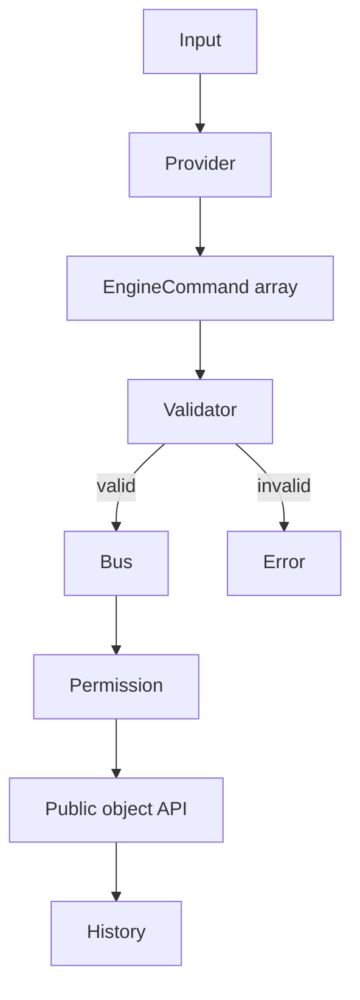

# AI command system

Providers implement `AIProvider.parseCommand(input, context)` and return structured commands.
`RuleBasedProvider` works offline; `MockAIProvider` is deterministic; Ollama and compatible
providers isolate transport and parsing.

The Playground passes a bounded scene context containing the current selection and up to 100 exact
object names to remote providers. Names are explicitly marked as untrusted JSON data in the system
prompt. Successful non-dry-run commands synchronize `CommandBus.selectedObject`, so subsequent
phrases such as `선택한 객체` resolve consistently. Deleting the selected object clears selection.

The offline provider supports deterministic Korean and English intents:

| Intent           | Example                         | Emitted command                   |
| ---------------- | ------------------------------- | --------------------------------- |
| Create           | `빨간 구를 만들어`              | `createObject`, `setColor`        |
| Compound create  | `파란 자동차를 만들어`          | `createObject`, `setColor`        |
| Multi-create     | `파란 큐브 3개를 만들어`        | three creates plus arranged moves |
| Move             | `sphere를 오른쪽으로 2 이동`    | `moveObject`                      |
| Rotate           | `큐브를 45도 회전`              | `rotateObject`                    |
| Motion           | `sphere를 천천히 계속 회전시켜` | `animateObject`                   |
| Scale            | `큐브를 두 배로 키워`           | `scaleObject`                     |
| Shape            | `큐브를 90도 휘어 비틀어`       | `deformObject`                    |
| Shape reset      | `cube의 원래 모양으로 초기화`   | `resetDeformation`                |
| Visibility       | `cube hide` / `cube show`       | `setVisible`                      |
| Duplicate/delete | `cube duplicate` / `cube 삭제`  | permission-checked commands       |

Object creation supports box, sphere and plane primitives plus editable procedural car, person,
face and tree hierarchies. Multi-create is capped at ten objects per instruction. Compound-model color changes
apply only to parts marked with the primary color role, preserving windows, wheels, eyes and hair.
This grammar is intentionally explicit and testable; it is not presented as general language
understanding.



Safety controls include:

- command allowlist and version check;
- finite numeric values and configurable movement/rotation/scale/deformation bounds;
- unique target resolution;
- deletion permission disabled by default;
- dry-run;
- bounded command history;
- selected-object and exact scene-name context for provider target resolution;
- no evaluation of provider text or generated code.

## Provider configuration

`OllamaProvider` posts to `{baseUrl}/api/chat`. The local default is
`http://127.0.0.1:11434`; browser use requires Ollama to permit the site's origin, commonly through
`OLLAMA_ORIGINS`. `OpenAICompatibleProvider` posts to `{baseUrl}/chat/completions` and sends an
optional key only in the `Authorization: Bearer ...` header.

```ts
const local = new OllamaProvider({
  baseUrl: "http://127.0.0.1:11434",
  model: "qwen3:8b",
});

const hosted = new OpenAICompatibleProvider({
  baseUrl: "https://provider.example/v1",
  model: "command-model",
  apiKey: shortLivedKey,
});
```

The static Playground keeps endpoint, model and key values in page memory only. It does not persist
them to local storage, session storage, URLs, logs or exported scenes. Direct browser calls are
intended for local learning and short-lived test credentials; production applications should use a
server-controlled proxy.
