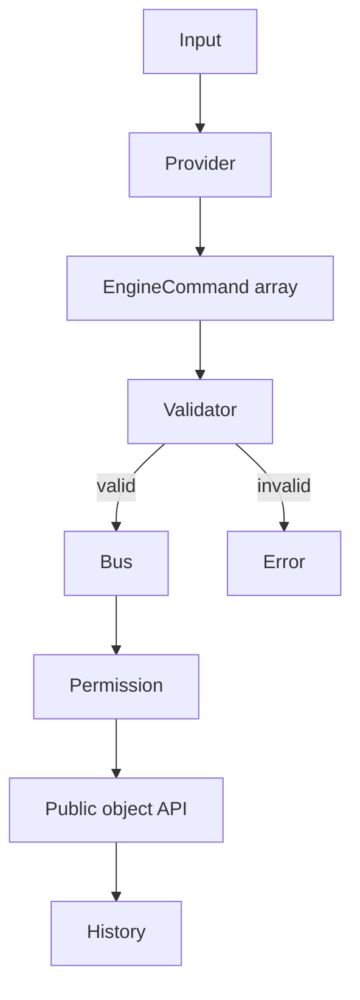

# AI command system

Providers implement `AIProvider.parseCommand(input, context)` and return structured commands.
`RuleBasedProvider` works offline; `MockAIProvider` is deterministic; Ollama and compatible
providers isolate transport and parsing.

Safety controls include:

- command allowlist and version check;
- finite numeric values and configurable movement/rotation/scale bounds;
- unique target resolution;
- deletion permission disabled by default;
- dry-run;
- bounded command history;
- no evaluation of provider text or generated code.
