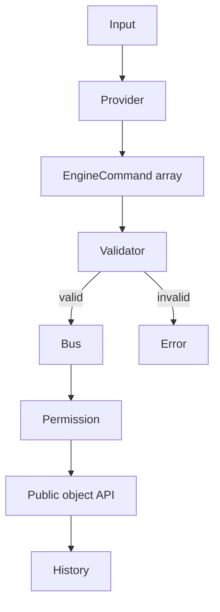

# AI command system

Providers implement `AIProvider.parseCommand(input, context)` and return structured commands.
`RuleBasedProvider` works offline; `MockAIProvider` is deterministic; Ollama and compatible
providers isolate transport and parsing.

The offline provider supports deterministic Korean and English intents:

| Intent           | Example                         | Emitted command                   |
| ---------------- | ------------------------------- | --------------------------------- |
| Create           | `빨간 구를 만들어`              | `createObject`, `setColor`        |
| Multi-create     | `파란 큐브 3개를 만들어`        | three creates plus arranged moves |
| Move             | `sphere를 오른쪽으로 2 이동`    | `moveObject`                      |
| Rotate           | `큐브를 45도 회전`              | `rotateObject`                    |
| Motion           | `sphere를 천천히 계속 회전시켜` | `animateObject`                   |
| Scale            | `큐브를 두 배로 키워`           | `scaleObject`                     |
| Visibility       | `cube hide` / `cube show`       | `setVisible`                      |
| Duplicate/delete | `cube duplicate` / `cube 삭제`  | permission-checked commands       |

Object creation is limited to box, sphere and plane primitives. Multi-create is capped at ten
objects per instruction. This grammar is intentionally explicit and testable; it is not presented
as general language understanding.

Safety controls include:

- command allowlist and version check;
- finite numeric values and configurable movement/rotation/scale bounds;
- unique target resolution;
- deletion permission disabled by default;
- dry-run;
- bounded command history;
- no evaluation of provider text or generated code.
