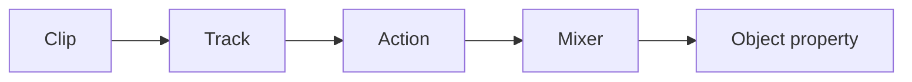

# Animation system

Tracks store times and packed values. Number and Vector3 tracks interpolate linearly; quaternion
tracks use slerp. Actions support play, pause, stop, repeat count, time scale and seek. A mixer
binds tracks to one root.

The alpha supports object property paths and intentionally excludes skeletal animation, blending
weights and retargeting.
