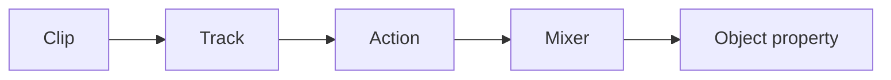

# Animation system



Tracks store times and packed values. Number and Vector3 tracks interpolate linearly; quaternion
tracks use slerp. Actions support play, pause, stop, repeat count, time scale and seek. A mixer
binds tracks to one root.

Scalar tracks can bind deterministic mesh-deformation accessors as well as ordinary object
properties:

```ts
new NumberKeyframeTrack("deformation.twist", [0, 1], [0, Math.PI]);
```

See [Mesh deformation](mesh-deformation.md) for the modifier order, validation rules and CPU/GPU
update lifecycle.

The alpha supports object property paths and intentionally excludes skeletal animation, blending
weights and retargeting.
