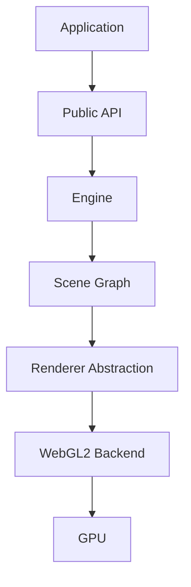
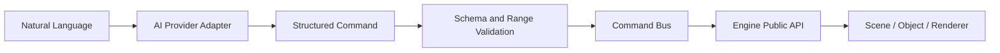
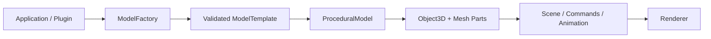
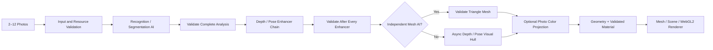
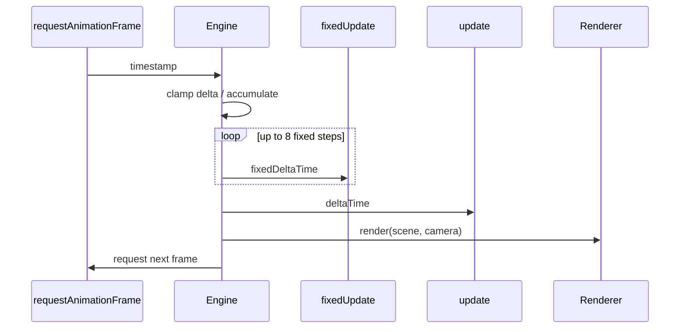

# Architecture

## Engine layers

The scene graph owns object state. The renderer consumes a scene and camera but does not control
application lifecycle. WebGL2-specific resources remain behind the renderer contract so a future
WebGPU backend can implement the same high-level operation.

## AI command flow

No provider response bypasses validation. The engine never executes generated source code.

## Procedural model flow

Factories are application-owned rather than global. Built-in and custom models therefore share
the normal scene graph while catalog contents and command exposure remain explicit.

## Photo reconstruction flow

The provider registry is application-owned and may contain offline, Ollama, compatible or
domain-specific services. `VisionAnalysisEnhancer[]` allows separate segmentation, depth and
camera-pose models to contribute without trusting one monolithic response. `VisionMeshGenerator`
can be supplied independently of the recognition provider. All routes converge on the same
resource and data validation boundary, and asynchronous voxel work observes `AbortSignal`.

## Frame loop

## Package direction

The alpha is a single package with folders as module boundaries. Imports generally point inward:
math → core → cameras/geometry/materials → models/reconstruction/renderer, with
commands/AI/assets/plugins consuming public object behavior. Type-only imports prevent lifecycle
contracts from introducing runtime cycles.

## Independent core boundary

The package has no runtime dependency on a completed 3D engine. ESLint rejects imports from
Three.js, Babylon.js, PlayCanvas, A-Frame and Cesium, and a unit test checks both runtime
dependencies and TypeScript source imports. Procedural models are composed from Verbis3D
`Object3D`, `Mesh`, `BoxGeometry`, `SphereGeometry` and `BasicMaterial`; they do not wrap an
external scene or renderer.
