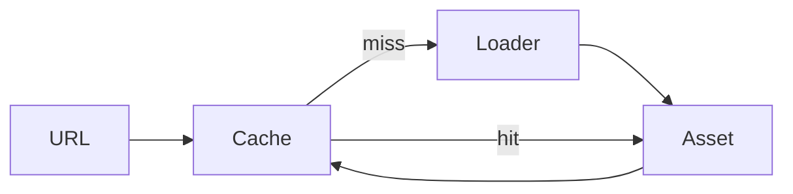

# Asset system

`AssetManager` deduplicates concurrent and repeated URL loads. Failed promises are removed so a
later call may retry. `JSONSceneLoader` supports safe data-only scene round-trips for alpha
primitives, procedural hierarchies and validated indexed buffer geometry produced by photo
reconstruction. Buffer position, normal, index and normalized vertex-color arrays are finite,
bounded and index-checked during import; `VertexColorMaterial` selection is restored only when its
required attribute exists. `TextureLoader`
fetches an image and uses `createImageBitmap`.

glTF and a production dependency graph are not implemented.
