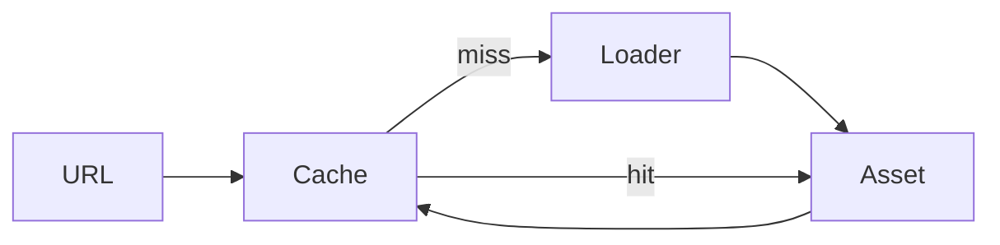

# Asset system

`AssetManager` deduplicates concurrent and repeated URL loads. Failed promises are removed so a
later call may retry. `JSONSceneLoader` supports safe data-only scene round-trips for alpha
primitives. `TextureLoader` fetches an image and uses `createImageBitmap`.

glTF and a production dependency graph are not implemented.
