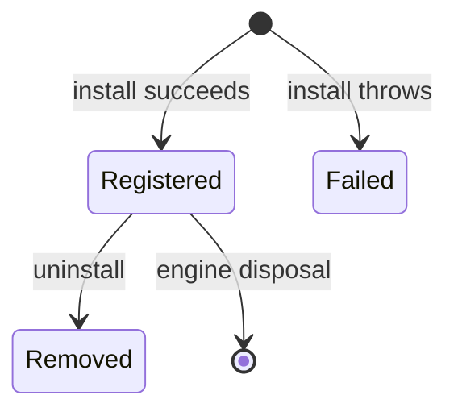

# Plugin system

Plugins have a unique name, version, install hook and optional uninstall hook. Duplicate names are
rejected. Installation failures are wrapped with plugin identity and are not registered.
Uninstall removes registry state even if cleanup reports an error.
