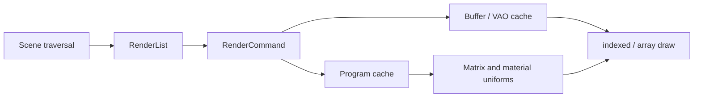

# Rendering pipeline

`WebGL2Renderer` updates scene/camera matrices, clears with the scene background, collects visible
meshes, applies material state, binds a program and VAO, uploads matrices/uniforms, and issues a
triangle draw.

The current alpha supports solid-color geometry only. Texture sampling, multiple passes, lights,
shadows and advanced sorting are planned. Resource creation is tracked for deterministic renderer
disposal.
