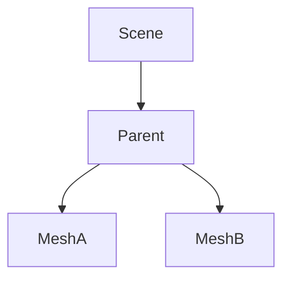

# Scene graph

`Object3D` stores identity, parent/children, position, Euler rotation, quaternion, scale, cached
local/world matrices, visibility, enabled state, user data and components.

Adding an ancestor beneath its descendant throws. Reparenting first removes the old parent.
Position, rotation, quaternion and scale mutation mark local/world state dirty; recalculation
propagates only where required.

Disposal detaches a node, disposes components and descendants, removes listeners, and prevents
further mutating operations that require a live node.
